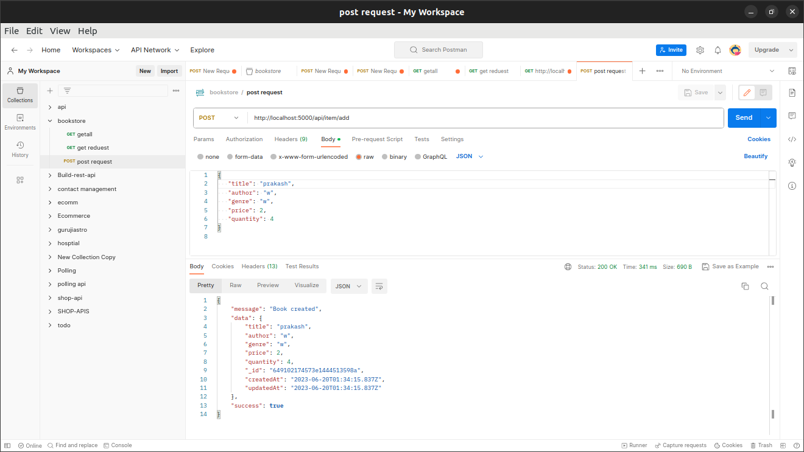
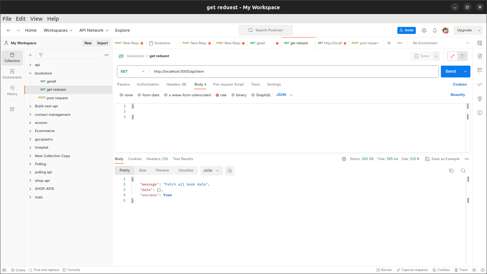
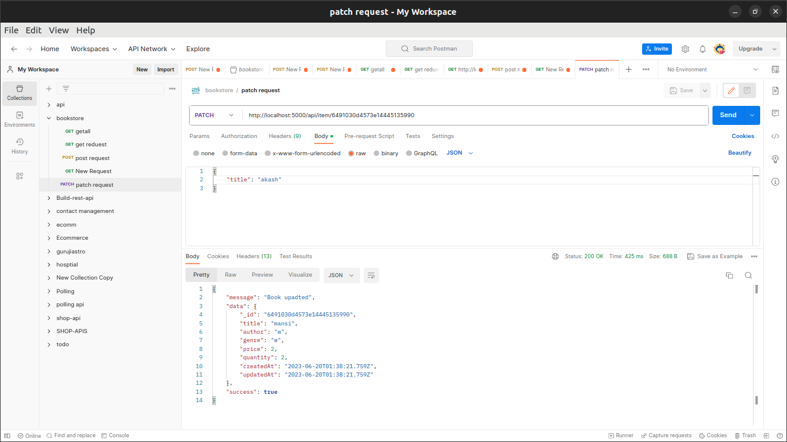
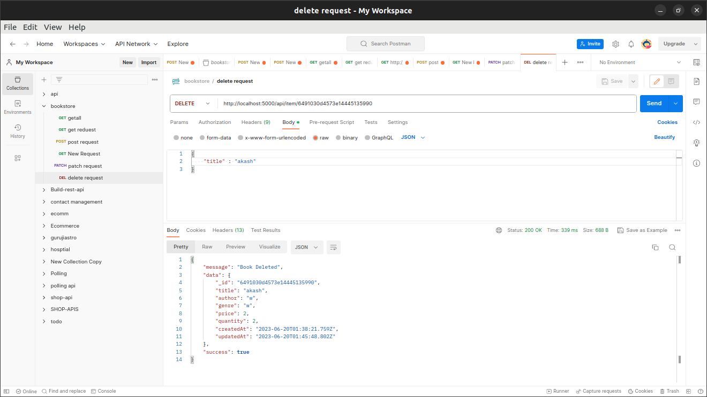

### ==================  first step ===================== #####

###  git clone this repository (https://github.com/prakashuniyal01/furation-tech)

### ==================  second step ===================== #####

### run command  ( npm install )

### ==================  third step ===================== #####

### setup mongo database used local url vs mongodb cluster  (I have connected the local url of mongodb, you can do the same of the cluster if you want.
)

### ==================  fourth step ===================== #####
### run command (npm run dec ) || npm start 
### if your server is successfully started 
### please read and follow http request folder 

### ======================================= #####

### post request

### post request

### post request

### post request

### post request
